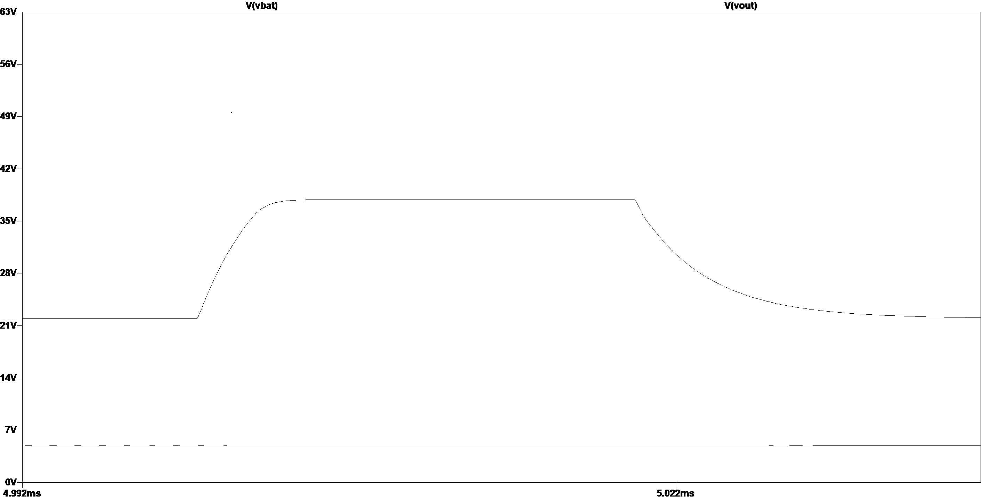
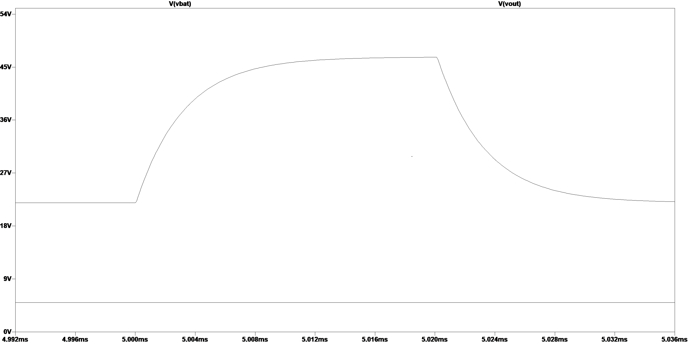

# stm32f722-flight-controller

This is a custom STM32F722 36 x 36 mm flight controller for racing quadcopters.

## About
 
This is my final year project, built to get hands-on experience and out of an interest in hobbyist drone builds. The board is a 36 x 36 mm 4-layer flight controller designed around an STM32F722, running Betaflight. I designed the schematic and the layout, simulated the power chain in LTspice before finalising the design, and had the board manufactured and assembled at JLCPCB. I built and soldered the drone by hand.

<p align="center">
  
  
</p>

<p align="center">
  
</p>

## Major components

- **STM32F722RET6** ARM Cortex-M7 MCU
- **BMI270** IMU (gyroscope and accelerometer)
- **BMP388** barometer
- **AP63205WU-7** 5 V buck converter
- **TPS73633DBVR** 3.3 V LDO regulator

## Block diagram


## Specifications
 
| | |
|---|---|
| Board size | 36 x 36 mm, 30.5 mm mounting holes |
| Layers | 4 |
| Input | 6S LiPo |
| Regulation | Buck to 5 V, LDO to 3.3 V |
| Motor protocol | DShot |
| Receiver protocol | CRSF |
| USB | USB-C |
| Interfaces | UART, I2C, SWD debug |

## Pin mapping
 
| Function | Pin | Notes |
|---|---|---|
| Motors 1 to 4 | B06, B07, B08, B09 | TIM4, DShot |
| Gyro | SPI, CS on B12, interrupt on C06 | BMI270 |
| Barometer | I2C, B10 (SCL), B11 (SDA) | BMP388 at 0x76 |
| Battery voltage sense | A05 | 100k / 10k divider |
| LED | A07 | |
| Receiver | UART3 | CRSF |
 
Full configuration in [`firmware/cli-diff.txt`](firmware/cli-diff.txt).

## Power design
 
Battery input goes through a TVS clamp, a buck converter to 5 V for the motors and peripherals, and an LDO to 3.3 V for the MCU and sensors, with a filtered rail feeding the IMU and barometer. Battery voltage is monitored through a 100k / 10k divider into an ADC input.
 
Simulated in LTspice before manufacture. The regulator in the simulations is an LT8610, used as a stand-in because no SPICE model is available for the AP63205.

**Transient response with the TVS diode.** A transient on the battery node is clamped to around 38 V and the 5 V rail is unaffected.
<p align="center">
  
</p>

**The same transient with the TVS removed**, reaching about 47 V. The difference between the two is the TVS doing its job.
 
<p align="center">
  
</p>

Even when clamped, the peak sits above the buck converter's 32 V operating range, which is why a higher voltage regulator or a lower clamping TVS is on the v2 list.

LTspice source files are in `simulation/`.
 
## Firmware
 
Runs Betaflight 4.5.1 with the IFLIGHT_BLITZ_F722 board configuration and custom CLI resource mappings for my pin assignment. The BMI270 and BMP388 are both detected and working.


## Bring-up
 
I brought the board up in stages and checked each one before moving on.
 
1. Visually inspected the soldering before applying any power
2. Applied power for the first time and confirmed the board came up without anything overheating
3. Confirmed the board enumerated over USB and entered DFU mode
4. Flashed the firmware and confirmed it booted into the configurator
5. Checked the IMU and barometer were returning live values
6. Bound the receiver and confirmed the channels responded
7. Tested and adjusted motor direction and spin with the props off
8. Flew it, with motor output capped at 70% for the first flights

## Build notes
 
- The pads are spaced tightly for hand soldering. Expect fiddly work.
- With only USB connected, the battery voltage reads around 4.6 V rather than zero. This is most likely USB 5 V back-feeding into the battery node through the buck converter, and it does not affect operation.

## Improvements for v2
 
- Move the LDO from the SOT-23-5 (DBV) package to DRB for lower thermal resistance, since it ran hot
- Change the TVS or move to a higher input voltage buck, so the worst case clamping voltage sits inside the regulator's rating
- Add a bulk low-ESR capacitor on the battery input to damp hot-plug transients and support motor current surges
- Rework power distribution so peripherals such as the camera and VTX cannot be powered through the USB 5 V rail, while keeping the onboard sensors powered from USB for bench testing, and improve the decoupling strategy
- Add Blackbox logging
- Increase pad spacing for easier hand soldering

## Repository layout
 
```
hardware/     schematic and layout PDFs, gerbers, BOM, pick and place
simulation/   LTspice files and exported plots
firmware/     CLI configuration and target notes
images/       board and build photos
```
 
## Licence
 
MIT
